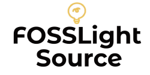

<center>

[](http://mod.lge.com/code/projects/OSC/repos/fosslight_source)
</center>

<p align="center">
  <strong>Source Code의 License를 분석합니다</strong><br>
  Source Code 스캐너를 이용하여 파일 안에 포함된 Copyright과 License 문구를 추출합니다.
</p>

<p align="center">
    
    
    
</p>

**FOSSLight Source** 소스 코드 스캐너인 [ScanCode][sc]를 이용하여, 파일 안에 포함된 Copyright과 License 문구를 추출합니다. Build Script, Binary, Directory, 특정 Directory (ex-test) 안의 파일은 분석 결과에서 제외시킵니다. 그리고 License 이름에서 "-only", "-old-style"와 같은 문구를 제거합니다. 분석 결과는 [OSS Report][or] 형태로 출력됩니다.

[sc]: https://github.com/nexB/scancode-toolkit
[or]: http://collab.lge.com/main/x/xDHlFg

## Contents

- [Prerequisite](#-prerequisite)
- [How to install](#-how-to-install)
- [How to run](#-how-to-run)
- [Result](#-result)
- [Documentation](#-documentation)
- [How to report issue](#-how-to-report-issue)
- [License](#-license)


## 📋 Prerequisite

FOSSLight Source는 Python 3.6+ 기반에서 동작합니다..    
Windows의 경우 [Microsoft Visual C++ Build Tools][ms_build]를 추가로 설치해야 합니다.

[ms_build]: https://visualstudio.microsoft.com/vs/older-downloads/

## 🎉 How to install

FOSSLight Source는 pip3를 이용하여 설치할 수 있습니다. [python 3.6 + virtualenv][anaconda] 환경에서 설치할 것을 권장합니다.

```
$ pip3 install "http://mod.lge.com/code/rest/archive/latest/projects/OSC/repos/fosslight_source/archive?format=zip" 
```
[anaconda]: http://collab.lge.com/main/x/RfxdTQ

## 🚀 How to run

FOSSLight Scanner에는 하기 두 가지 명령어가 있습니다. 
- **fosslight_source** : Source Code 분석을 실행한 후 OSS Report 형식으로 출력.
- **fosslight_convert** : json형태인 ScanCode 결과를 OSS Report 형식으로 변환.

### 1. Parameter of fosslight_source      
| Parameter  | Argument | Description |
| ------------- | ------------- | ------------- |
| h | None | Print help message. | 
| p | String | Path to analyze source. | 
| j | None | As an output, the result of executing ScanCode in json format other than OSS Report is additionally generated. | 
| o | String | Output file name without file extension. | 

### 2. Parameter of fosslight_convert      
| Parameter  | Argument | Description |
| ------------- | ------------- | ------------- |
| h | None | Print help message. | 
| p | String | Path of ScanCode json files. | 
| o | String | Output file name without file extension. | 
   

### Ex 1. Source Code 분석 후 OSS Report와 json 형태의 ScanCode 결과 출력
```
$ fosslight_source -p /home/source_path -j
```

### Ex 2. json 형태의 ScanCode 결과를 OSS Report 형식으로 변환
```
$ fosslight_convert -p /home/jsonfile_dir
```

## 📁 Result

```
$ tree
.
├── OSS-Report_2021-03-21_20-44-34.xlsx
├── fosslight_src_log_2021-03-21_20-44-34.txt
├── result_2021-03-21_20-44-34.csv
└── scancode_2021-03-21_20-44-34.json

```
- OSS_Report-[datetime].xlsx : OSS Report형태의 Source Code 분석 결과
- result_[datetime].csv : OSS Report를 csv로 출력한 결과 (Windows 제외)
- scancode_[datetime].json : ScanCode 실행 결과 (-j 옵션이 포함된 경우에만 생성)
- fosslight_src_log_[datetime].txt: 실행 로그가 저장된 파일


## 👏 How to report issue

개선 사항이나 버그는 [OSC CLM][cl]에 이슈를 생성하여 리포트해주시기 바랍니다. 이슈 리포트는 FOSSLight Scanner 업그레이드에 많은 도움이 됩니다.

[cl]: http://clm.lge.com/issue/browse/OSC

## 📄 License

FOSSLight Source는 LGE Proprietary License 입니다. License 원문 파일 [LICENSE][l]를 참고하십시오.

[l]: http://mod.lge.com/code/projects/OSC/repos/fosslight_source/browse/LICENSE
